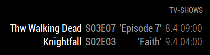

# [Trakt.tv]-Module for the [MagicMirror](https://github.com/MichMich/MagicMirror/)
_If you'd like to contribute, pull requests are welcome!_



### Todo

- [x] CSS
- [ ] Pictures for the shows
- [x] More configuration options


### Creating a [Trakt.tv] API [application]

To get your API keys you need to first create an [application]. Give it a name, and enter `http://localhost/` in the callback field _(it's a required field but not used for our purpose)_.


## Installation

Clone the repository into your MagicMirror's modules folder, and install dependencies:

```sh
  cd ~/MagicMirror/modules
  git clone https://github.com/Kiina/MMM-trakt
  cd MMM-trakt
  npm install
```


## Configuration

To run the module, you need to add the following data to your ` ~/MagicMirror/config/config.js` file:

```js
{
  module: 'MMM-trakt',
  position: 'top_center', // you may choose any location
  header: 'TV-Shows', // optional
  config: {
    client_id: 'YOUR_API_CLIENT_ID',
    client_secret: 'YOUR_API_CLIENT_SECRET',
    days: 1, // optional, default: 1. 1 = today's episodes, 2 = today's and tomorrow's, 3 = etc...
    styling : {
        moduleSize: "small", // optional, possible value: (xsmall, small, medium, large, xlarge), default: small
        daysUntil: false, // optional, shows 'today' and 'tomorrow' instead of date, default: false
        daysUntilFormat: "hh:mm", // optional, default: "hh:mm", time format after 'today'. Leave empty ("") to hide, possible values: https://momentjs.com/docs/#/displaying/format/
        dateFormat: "D.M hh:mm", // optional, default: "D.M hh:mm", possible values: https://momentjs.com/docs/#/displaying/format/
        showEpisodeTitle: true, // optional, default: true
    },
    debug: false // optional, default: false
  }
}

```

[Trakt.tv]:(https://trakt.tv/)
[application]: (https://trakt.tv/oauth/applications/new)
